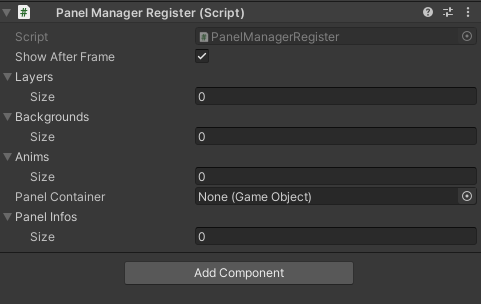

### 6. 面板管理模块

+ **JLGames.GameDriver.Actions.Layer** 提供了容器层级管理功能。

+ **JLGames.GameDriver.Games.PanelManager** 提供了面板管理功能。

#### 2.1 使用前信息注册

1. 注册层容器信息
   ```C#
   PanelManagerShared.Manager.Register.RegisterLayer(containerName, tranContainer, isDefault);
   ```
   
   
   + layerName: 为注册的层信息指定一个名称，与layer的name属性无关。
   
   + layer: 层的Transform组件引用.
   
   + default: 是否设置为默认，如果为true，当打开面板时不指定层名称，则选择默认层。

2. 注册背景处理信息
   ```C#
   PanelManagerShared.Manager.Register.RegisterBackground(backgroundKey, backgroundOrigin, backgroundScript);
   ```
   

   + key: 为注册的背景信息指定一个key， 用于标识信息的唯一性。
   
   + origin: 背景的预制件, 当展示面板时, 克隆预制件添加到面板容器的最底层。
  
   + script: 处理背景逻辑的脚本组件的类名(包含命名空间)。

3. 注册动画信息
   ```C#
   PanelManagerShared.Manager.Register.RegisterAnimator(animKey, animAnimator);
   ```
   

   + key: 为注册的动画信息指定一个Key， 用于标识信息的唯一性。
   
   + animator: 动画RuntimeAnimatorController组件。

4. 注册面板的基础容器
   ```C#
   PanelManagerShared.Manager.Register.RegisterPanelContainer(container);
   ```
   
   
   + container: 面板容器的预制件，当展示面板时, 克隆预制件作为面板根节点添加到展示层中, 面板的实际内容任务子节点添加到面板容器中。
   
4. 注册面板信息
   ```C#
   PanelManagerShared.Manager.Register.RegisterPanelInfo(panelId, settings, maxDisplayNum, extendType);
   ```
   
   
   + 面板信息最终以IPanelInfo的实例保存起来用于查找与展示。
   
   + 项目使用时，应该读取项目面板的配置信息，并注册进来。

5. 使用PanelManagerRegister组件，可以同时处理层容器、背景、动画以及面板信息的注册功能
   

#### 2.2 使用
   
#### 2.3 示例

  GameDriver/Samples/Loader
  