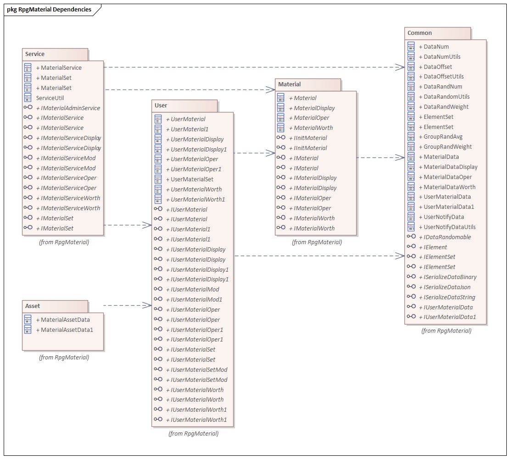

## 7. Rpg材料数据系统
这是一套通用的玩家数据管理系统。
针对玩家的数值型数据，以KTV(Key-Type-Value)形式进行管理。

+ **JLGames.GameDriver.Games.RpgMaterial** 
  提供了Rpg材料数据系统的功能支持。依赖关系如下：
  
  
  + **JLGames.GameDriver.Games.RpgMaterial.Common**
    系统的基础数据结构。
  + **JLGames.GameDriver.Games.RpgMaterial.Material**
    系统中关于材料定义的数据结构。
  + **JLGames.GameDriver.Games.RpgMaterial.User**
    系统中关于用户数据存储的数据结构。
  + **JLGames.GameDriver.Games.RpgMaterial.Service**
    系统中关于对外提供接口支持的数据结构。
  + **JLGames.GameDriver.Games.RpgMaterial.Asset**
    系统中针对Unity进行序列化的数据结构。

### 7.1 设计思路

+ 玩家数据的元数据以 **KTD(Key-Type-Define)** 形式进行管理。
+ 元数据的来源可以是数值表导出、服务器获取、资产配置等方式得到。
+ 通过 **KT(Key&Type)** 能得到元数据定义(Define)，并且可以在玩家数据设置时进行有效性检查。
+ 玩家数据以 **KTV(Key-Type-Value)** 形式进行保存(内存、本地文件、服务器等)。
+ 同一条元数据定义下，如果玩家数据要求有多条，则采用 **KTUV(Key-Type-UId-Value)** 形式进行保存，既兼容了普通数据格式，也支持了多条数据的要求。
+ 玩家数据(Value)通常情况下使用基础数值类型则满足需求，当然游戏设计者可以扩展数据的存储结构。
+ 通过 **KT(Key&Type)** 或 **KTU(Key&Type&UId)** 能得到玩家的具体数据(Value)，用于运算与展示。
+ 玩家数据的变更以通知的形式下发，支持增量变更与直接更新两种。

#### 7.1.1 Common模块设计说明

#### 7.1.2 Material模块设计说明

#### 7.1.3 User模块设计说明

#### 7.1.4 Service模块设计说明

#### 7.1.1 Asset模块设计说明

### 7.2 使用

### 7.3 示例
GameDriver/Samples/Service
