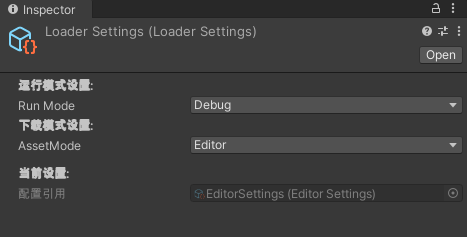
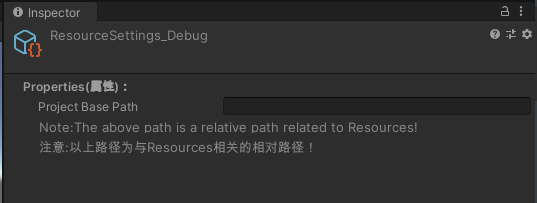
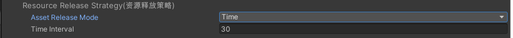

# Getting Started

### 概述

本用户指南旨在为 GameDriver Pro 用户提供关于工具的基本概述、功能和用法。

### 安装

从Unity的Asset Store下载GameRiver Pro后，请转到：“Assets->Import Package->Custom Package...”。 在“导入资产”窗口中，查找并选择GameDriver Pro UnityPackage文件。 在“导入软件包”窗口中出现Unity之后，请验证所有项目选择导入，然后单击窗口右下方的导入按钮。 GameDriver Pro的全部文件将加入到Assets/GameDriver中。

您也可以选择所需的部分进行导入。

### 支持

如果您想快速了解 GameDriver Pro 中的重要功能，可以直接参考GameDriver/Samples中的示例。

如果您想详细了解 GameDriver Pro 中的各功能模块的设计思路和细节, 您可以在[在线帮助](http://www.xuzhuoxi.com/GameDriver-Docs/)中找到更多信息和常见问题解答。  

如果您无法要查找您寻求的信息，请随时在Github仓库 [GameDriver-Docs](https://github.com/xuzhuoxi/GameDriver-Docs) 提交Issues, 或者联系xuzhuoxi@gmail.com 或 mailxuzhuoxi@163.com

# 功能

GameDriver Pro中的源代码存放位置是有规律的。

1. **GameDriver/Runtime/CSharp** 中的源码**只依赖**于C#标准库，**不依赖**Unity标准库。 是对C#的扩展功能。

2. **GameDriver/Runtime/Actions** 中的源码**依赖**于Core和Unity标准库。 是对Unity引擎的扩展功能。

3. **GameDriver/Runtime/Games** 中的源码依赖于Core与Actions。 是游戏开发过程常用的系统功能的通用实现。


## 1. 事件(Event) - 高效的事件模块，支持Unity多线程

事件采用“**监听**-**捕获**”机制，监听时支持捕获次数、 捕获优先级的设置。

+ **JLGames.GameDriver.CSharp.Event** 负责事件系统的核心逻辑实现。

+ **JLGames.GameDriver.Actions.ThreadEvent** 针对多线程提供支持。

#### 核心功能 - 添加监听、移除监听、分发事件

1. 监听
   接口IEventListener中  `AddEventListener`系列函数用于添加事件监听。
   实现类EventDispathver中已经完成逻辑实现。
   

2. 移除监听
   接口IEventListener中 `RemoveEventListener`系列函数用于移除事件监听。
   实现类EventDispathver中已经完成逻辑实现。
   

3. 分发事件
   接口IEventDispatcher中 `DispatchEvent`系列函数用于分发事件。
   实现类EventDispathver中已经完成逻辑实现。
   

4. 多线程支持
   接口IThreadEventProxy中声明的函数定义了多线程支持规范。
   实现类ThreadEventDispatcher中已经完成逻辑实现
   

5. 扩展
   继承EventDispathver或ThreadEventDispatcher并实现自定义接口，可用于扩展事件行为。

示例：GameDriver/Samples/Event

### 2.加载管理模块(Loader) -  支持Resources、Editor、Assetbundle三种模式自由切换

+ **JLGames.GameDriver.Actions.Loader** 提供了加载器全部的功能支持。

+ **“Tools -> GameDriver -> Project -> Gen LoaderSettings”**提供了加载器配置文件的生成入口。

以下是为项目部署Loader的过程：

1. 执行菜单 “Tools -> GameDriver -> Project -> Gen LoaderSettings”。在项目Assets/Resources下会生成 LoaderSettings.asset(可重命名) 文件。


2. LoaderSettings中共有5个可用配置，一个是Editor模式， 两个是Resource模式， 剩下两个是AssetBundle模式。

  + Editor配置
    ProjectBasePath可以设置项目的资源查找的基础路径部分，在加载资源时可拼接到资源路径前。
    
  
  + Resource配置
    ProjectBasePath可以设置项目的资源查找的基础路径部分，在加载资源时可拼接到资源路径前。
     
  
  +  AssetBundle配置

    + BundleSource 可选择Web、Streaming Assets、File Debug三种模式。

      + Web 用于加载直接存入在站点上的AssetBundle资源。
        Web Site Url 中填入站点Url。
        Web Site Pattern 中填入Parttern路径。 
        
      
      + Streaming Assets 用于加载存放在项目StreamingAssets中的AssetBundle资源。
        Streaming Parttern 中填入相对于StreamingAssets的相对路径。
        
      
      + File Debug 用于加载本地文件系统中的AssetBundle资源，多用于调试。
        File Url 中填入本机文件路径。
        File Pattern 中填入与File Url相关的相对路径。 
         

    + Base Settings
    
      主要是关于项目的Bundle目录信息的设置与加载时缓存信息的设置。
      
      + Project Base Path 设置项目的Bundle目录路径
      
      + CacheName 设置缓存区的名称，这个可以自定义。
      
      + Version Size 设置每个Bundle资产在缓存中保留的版本数量。
      
      + History size 设置缓存区数量，每一个CacheName会产生一个缓存区。
    
    + Resource Release Strategy 可选择None、Time、Counter三种。
      
      + None为不选择释放策略，释放Bundle与资产后产生的无效内存占用需要自己调用gc释放，该策略适合自行管理内存与gc时机。
      
      + Time为计时释放策略，会按照设定的时间周期调用gc。
         
      
      + Counter为计数释放策略， 当bundle加载资源到达设定值及倍数值时调用gc. 
         

3. 使用配置初始化加载器
   
   使用以下API初始化加载器：
   
   + 使用由[第一点]()生成的配置文件名称进行初始化。
   
     ```C#
     LoaderManager.InitLoader(string loaderName, string settingsName);
     ```
   
   + 使用配置实例进行初始化。
   
     ```C#
     LoaderManager.InitLoader(string loaderName, LoaderSettings settings);
     ```

   + Loader静态类中有快捷初始化函数：
   
     ```C#
     Loader.InitLoader(string settingsName);
     ```

4. 获得加载器实例

   LoaderManager是加载器实例引用的管理器，提供获取加载器实例的函数。
   
   加载器实例要求实例化ILoader接口， 包含了IBundleLoader与IAssetLoader接口

   + 获取默认实例： 
     
     ```C#
     LoaderManager.DefaultManager;
     ```
   
   + 获取指定实例： 
     
     ```C#
     LoaderManager.FindLoader(string loaderName);
     ```

5. 初始化Bundle版本信息

   调用加载器实例中函数：
   
   ```C#
   InitVersion(LoaderDelegate.OnAssetLoaded<AssetBundleManifest> onVersionAssetBundleLoaded);
   ```
   
   函数回调为初始化版本结束后执行，内部可判断初始化结果：成功 或 失败。
   
   函数要求开启协程调用, 可以使用LoaderManager.Mono开启协程：
   
   ```C#
   LoaderManager.Mono.StartCoroutine(LoaderManager.DefaultLoader.InitVersion(onVersionLoaded));
   ```

6. 加载Bundle资产

   在Bundle版本信息初始化完成后，才可以加载Bundle资产。

   加载器实现了IBundleLoader接口, 包含的函数与加载Bundle资产相关。

   加载Bundle资产要求使用协程，可以使用LoaderManager.Mono实例启用协程加载Bundle.
   
   ```C#
   LoaderManager.Mono.StartCoroutine(
      LoaderManager.DefaultLoader.LoadBundleAsync(
         bundleName, onBundleLoaded, autoRelease, unloadAllLoadedObjects))
   ```
   
   + bundleName: bundle资产名称。
   
   + onBundleLoaded: 执行结果回调, 内部可判断成功与否。
   
   + autoRelease: 指明在onBundleLoaded执行结束后是否释放bundle实例
   
   + unloadAllLoadedObjects: 指明在onBundleLoaded执行结束后是否释放从bundle实例中实例化的资源资产

   + 如果autoRelease为true, 在onoBundleLoaded中应该实例化全部要使用的资源资产。

7. 加载资源资产

   在获得bundle实例的情况下， 可以从bundle实例中实例化出资源资产的实例， 然后再克隆使用。

   加载资源资产建议使用同步函数，不建议使用异步。 原因是Unity对于在协程内部开启协程支持得不友好， 层级过多(好像是16层)会出现无法预测的报错。

   IAssetLoader接口函数分四类：
   
   + 单个资源资产加载(同步|异步)
   
   ```C#
   /// <summary>
   /// Load asset from bundle synchronously with relative path
   /// 使用相对路径从Bundle中加载资源
   /// </summary>
   /// <param name="assetPath">资源路径</param>
   /// <param name="bundle">资源包</param>
   /// <typeparam name="T">资源类型</typeparam>
   /// <returns></returns>
   T LoadAssetSync<T>(string assetPath, AssetBundle bundle) where T : Object;

   /// <summary>
   /// Load asset from bundle synchronously with full path
   /// 使用完整路径从Bundle中加载资源
   /// The full path：refers to the relative path after removing ProjectBasePath
   /// 完整路径：指的是去除ProjectBasePath后的相对路径
   /// </summary>
   /// <param name="fullPath">完整资源路径,忽略设置的ProjectBasePath</param>
   /// <param name="bundle">资源包</param>
   /// <typeparam name="T">资源类型</typeparam>
   /// <returns></returns>
   T LoadAssetSyncFull<T>(string fullPath, AssetBundle bundle) where T : Object; 
   
   /// <summary>
   /// Asynchronously load resources from bundle
   /// 异步从资源包中加载资源
   /// </summary>
   /// <param name="assetPath">资源路径</param>
   /// <param name="bundle">资源包</param>
   /// <param name="onAssetLoaded">回调</param>
   /// <typeparam name="T">资源类型</typeparam>
   /// <returns></returns>
   IEnumerator LoadAssetAsync<T>(string assetPath, AssetBundle bundle, LoaderDelegate.OnAssetLoaded<T> onAssetLoaded) where T : Object;
   ```
   
   + 批量资源资产加载(同步|异步)
   
   ```C#
    /// <summary>
    /// Synchronized load resources from bundle in batches
    /// 同步批量从资源包中加载资源
    /// </summary>
    /// <param name="assetPaths">资源路径</param>
    /// <param name="bundle">资源包</param>
    /// <typeparam name="T">资源类型</typeparam>
    /// <returns></returns>
    T[] LoadAssetsSync<T>(string[] assetPaths, AssetBundle bundle) where T : Object;

    /// <summary>
    /// Synchronized load resources from bundle in batches
    /// 同步批量从资源包中加载资源
    /// </summary>
    /// <param name="fullPaths">完整资源路径,忽略设置的ProjectBasePath</param>
    /// <param name="bundle">资源包</param>
    /// <typeparam name="T">资源类型</typeparam>
    /// <returns></returns>
    T[] LoadAssetsSyncFull<T>(string[] fullPaths, AssetBundle bundle) where T : Object;
   
    /// <summary>
    /// Batch asynchronously load resources from bundle
    /// 异步从资源包中批量加载资源
    /// </summary>
    /// <param name="assetPaths">路径数组</param>
    /// <param name="bundle">资源包</param>
    /// <param name="onMultiAssetLoaded">回调</param>
    /// <typeparam name="T"></typeparam>
    /// <returns></returns>
    IEnumerator LoadMulitAssetAsync<T>(string[] assetPaths, AssetBundle bundle, LoaderDelegate.OnMultiAssetLoaded<T> onMultiAssetLoaded)
            where T : Object;
   ```
   
   + 单个子资源资产加载(同步|异步)
   
   ```C#
   /// <summary>
   /// Load sub-resources (sprites, prefabs, etc.)
   /// 加载子资源(子图、预置等)
   /// </summary>
   /// <param name="path"></param>
   /// <param name="subName"></param>
   /// <param name="ab"></param>
   /// <returns></returns>
   Object LoadSubAssetSync(string path, string subName, AssetBundle ab);

   /// <summary>
   /// Load sub-resources (sprites, prefabs, etc.)
   /// 加载子资源(子图、预置等)
   /// </summary>
   /// <param name="path"></param>
   /// <param name="subName"></param>
   /// <param name="type"></param>
   /// <param name="ab"></param>
   /// <returns></returns>
   Object LoadSubAssetSync(string path, string subName, Type type, AssetBundle ab);

   /// <summary>
   /// Load sub-resources (sprites, prefabs, etc.)
   /// 加载子资源(子图、预置等)
   /// </summary>
   /// <param name="path"></param>
   /// <param name="subName"></param>
   /// <param name="ab"></param>
   /// <returns></returns>
   T LoadSubAssetSync<T>(string path, string subName, AssetBundle ab) where T : Object;
           
   /// <summary>
   /// Load sub-resources (sprites, prefabs, etc.) from bundles asynchronously
   /// 异步从资源包中加载加载子资源(子图、预置等)
   /// </summary>
   /// <param name="assetPath">资源路径</param>
   /// <param name="subName"></param>
   /// <param name="bundle">资源包</param>
   /// <param name="onAssetLoaded">Callback(回调)</param>
   /// <typeparam name="T">Resource type(资源类型)</typeparam>
   /// <returns></returns>
   IEnumerator LoadSubAssetAsync<T>(string assetPath, string subName, AssetBundle bundle, LoaderDelegate.OnAssetLoaded<T> onAssetLoaded)
            where T : Object;
   ```
   
   + 批量子资源资产加载(同步|异步)

   ```C#
   /// <summary>
   /// Load all sub-resources (sprites, prefabs, etc.)
   /// 加载子资源(子图、预置等)
   /// </summary>
   /// <param name="path"></param>
   /// <param name="type"></param>
   /// <param name="bundle"></param>
   /// <returns></returns>
   Object[] LoadSubAssetsSync(string path, Type type, AssetBundle bundle);

   /// <summary>
   /// Load all sub-resources (sprites, prefabs, etc.)
   /// 加载子资源(子图、预置等)
   /// </summary>
   /// <param name="path"></param>
   /// <param name="bundle"></param>
   /// <typeparam name="T"></typeparam>
   /// <returns></returns>
   T[] LoadSubAssetsSync<T>(string path, AssetBundle bundle) where T : Object;

   /// <summary>
   /// Load sub-resources (sprites, prefabs, etc.)
   /// 加载子资源(子图、预置等)
   /// </summary>
   /// <param name="path"></param>
   /// <param name="subNames"></param>
   /// <param name="bundle"></param>
   /// <returns></returns>
   Object[] LoadSubAssetsSync(string path, string[] subNames, AssetBundle bundle);

   /// <summary>
   /// Load sub-resources (sprites, prefabs, etc.)
   /// 加载子资源(子图、预置等)
   /// </summary>
   /// <param name="path"></param>
   /// <param name="subNames"></param>
   /// <param name="type"></param>
   /// <param name="ab"></param>
   /// <returns></returns>
   Object[] LoadSubAssetsSync(string path, string[] subNames, Type type, AssetBundle ab);

   /// <summary>
   /// Load sub-resources (sprites, prefabs, etc.)
   /// 加载子资源(子图、预置等)
   /// </summary>
   /// <param name="path"></param>
   /// <param name="subNames"></param>
   /// <param name="bundle"></param>
   /// <typeparam name="T"></typeparam>
   /// <returns></returns>
   T[] LoadSubAssetsSync<T>(string path, string[] subNames, AssetBundle bundle) where T : Object;

   /// <summary>
   /// Load sub-resources (sprites, prefabs, etc.) from bundles asynchronously
   /// 异步从资源包中加载加载子资源(子图、预置等)
   /// </summary>
   /// <param name="assetPath">资源路径</param>
   /// <param name="buundle">资源包</param>
   /// <param name="onAssetsLoaded">Callback(回调)</param>
   /// <typeparam name="T">Resource type(资源类型)</typeparam>
   /// <returns></returns>
   IEnumerator LoadSubAssetsAsync<T>(string assetPath, AssetBundle buundle, LoaderDelegate.OnMultiAssetLoaded<T> onAssetsLoaded)
            where T : Object;
   ```

8. 更多用法请参考示例、API或源码
   
   示例： GameDriver/Samples/Loader
   

### 3.国际化(i18n) - 轻量级国际化解决方案

+ **JLGames.GameDriver.Actions.i18n** 提供了国际化模块全部的功能支持。

1. 向注册表中注册语言信息。
2. 向注册表中注册相关数据文件信息。
3. 管理器根据注册表加载数据集。
4. 

+ 通过三个步骤初始化国际化管理器：注册语言、注册文件信息、 加载数据到国际化管理器II18NManager

### 4.音频管理(AudioManager) - 完善的音频管理模块，支持场景与UI的音乐音效同时，去除Assetbundle的依赖。

### Panel - UI面板与层级管理模块。

### RpgMaterial - 游戏数据管理模型

### Service - 服务扩展

### Net - 简单易用的网络链接管理模块，并提供一套模拟服务器扩展实现，对单机游戏与独立游戏非常友好。

## Editor功能