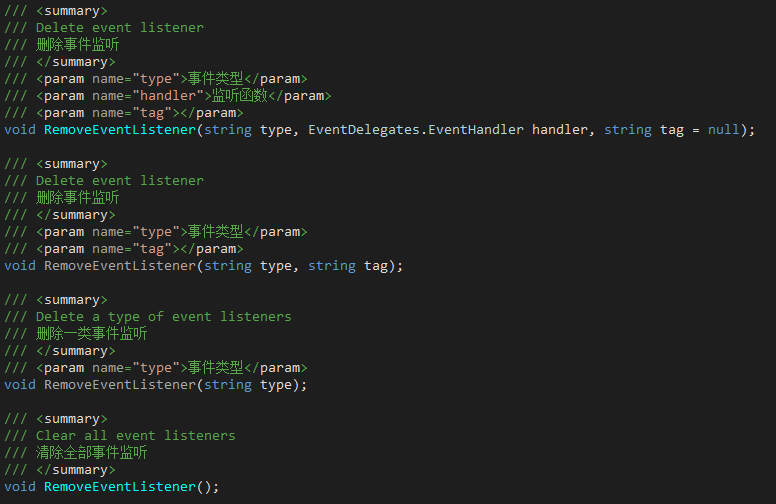

## 1. 事件(Event) - 高效的事件模块，支持Unity多线程

事件采用“**监听**-**捕获**”机制，监听时支持捕获次数、 捕获优先级的设置。

+ **JLGames.GameDriver.CSharp.Event** 负责事件系统的核心逻辑实现。
+ **JLGames.GameDriver.Actions.ThreadEvent** 针对多线程提供支持。

### 1.1 核心功能 - 添加监听、移除监听、分发事件

#### 1.1.1 监听
接口IEventListener中  `AddEventListener`系列函数用于添加事件监听。
实现类EventDispathver中已经完成逻辑实现。

#### 1.1.2 移除监听
接口IEventListener中 `RemoveEventListener`系列函数用于移除事件监听。
实现类EventDispathver中已经完成逻辑实现。

#### 1.1.3 分发事件
接口IEventDispatcher中 `DispatchEvent`系列函数用于分发事件。

实现类EventDispathver中已经完成逻辑实现。

#### 1.1.4 多线程支持
接口IThreadEventProxy中声明的函数定义了多线程支持规范。

实现类ThreadEventDispatcher中已经完成逻辑实现

#### 1.1.5 扩展
继承EventDispathver或ThreadEventDispatcher并实现自定义接口，可用于扩展事件行为。

### 1.2 示例：
GameDriver/Samples/Event

