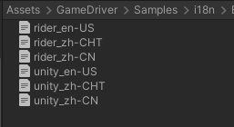
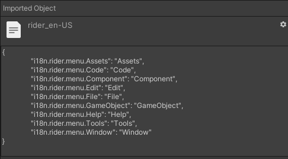
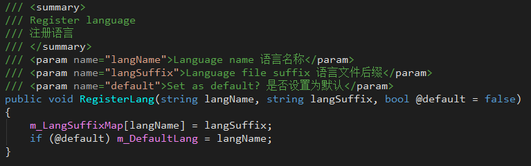
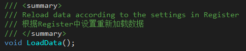
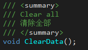
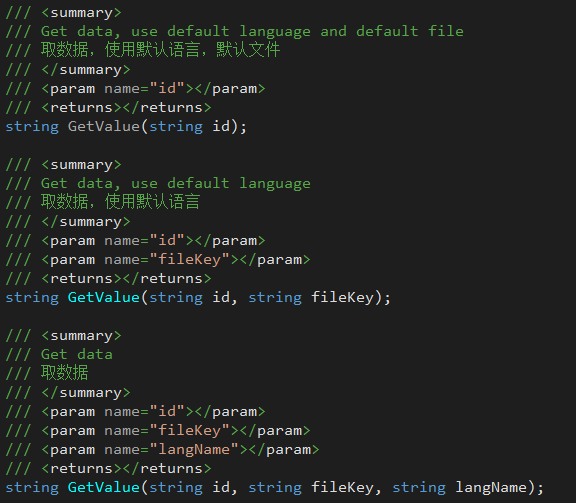

## 3. Internationalization (i18n) - Lightweight Internationalization Solution

+ **JLGames.GameDriver.Actions.i18n** provides full functional support for the internationalization module.
+ [BabelEdit](https://www.codeandweb.com/babeledit) is recommended for authoring management datasets.

### 3.1 Initialization
Follow the process below to configure internationalization for your project:  

#### 3.1.1 Clarify the types of international languages ​​that the project needs to support
Here are **English[English]**, **Chinese[Simplified]**, **Chinese[Traditional]** as examples.  

#### 3.1.2 Prepare internationalization data files
Multiple file sets are supported, here are two file sets **unity**, **rider** for example.  
  
The data format is in the form of Key-Value:  
  
The current test dataset is authored using Jetbrains' [BabelEdit]  (https://www.codeandweb.com/babeledit), which is a nice tool.  

#### 3.1.3 Register languages ​​with the registry.
Call the RegisterLang function in the I18NRegister instance:  
  
+ langName as langSuffix suggests.
+ default=true sets the current language as the default language.
  
#### 3.1.4 Loading information to the registry registration file set
Call the RegisterFile function in the I18NRegister instance:  
  
+ fileKey is used to identify the currently set fileset.
+ default=truej Set the current fileset as the default fileset.

#### 3.1.5 According to the registry, load data into the manager
Call the LoadData function in the II18NManager instance:  
`I18NManagerShared.Manager.LoadData();`
  

**NOTE**: If you have performed load data in the past, you should clear the old data first:  
`I18NManagerShared.Manager.ClearData();`
  

### 3.2 Use

#### 3.2.1 Use the I18NTMPText component to add internationalization support to TMP_Text.
Add I18NTMPText component to TMP_Text node  
  
+ File Key is the fileKey parameter when registering a file set.
+ Auto Refresh When checked, the manager will refresh itself after reloading the data.
  
#### 3.2.2 Use the I18NText component to add internationalization support to Text.
Add I18NText component to Text node  
  
+ File Key is the fileKey parameter when registering a file set.
+ Auto Refresh When checked, the manager will refresh itself after reloading the data.

#### 3.2.3 Reading internationalized data in code.
`I18NManagerShared.Manager.GetValue(id, fileKey, lang);`
  

### 3.3 Example
GameDriver/Samples/i18n  
  