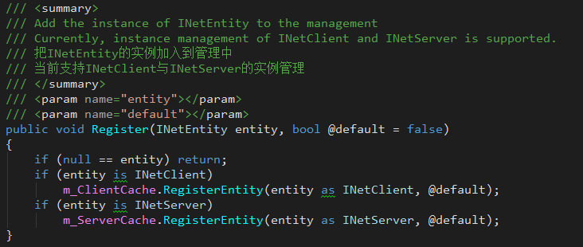
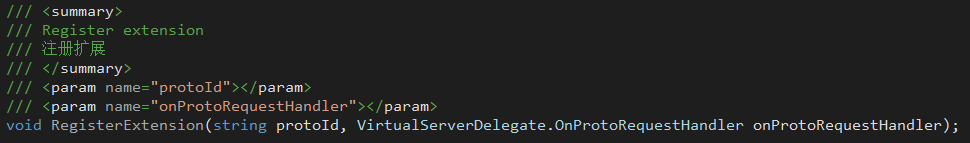
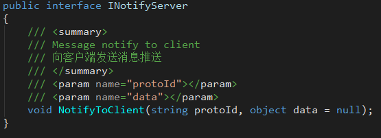
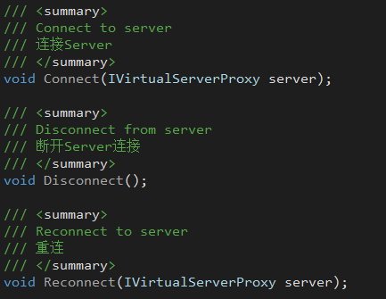
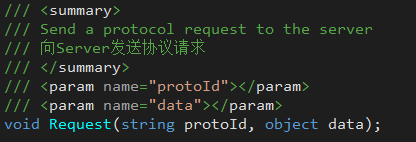

## 4. 网络管理扩展模块(NetManager)
简单易用的网络链接管理模块  
+ **JLGames.GameDriver.CSharp.Net** 提供了C# 针对 Socket API 的一个封装， 使开发者可以对TCP、UDP、 HTTP(HTTPS)、WebSocket(WebSockets)等协议在同一套API上进行开发。
+ **JLGames.GameDriver.CSharp.Net** 同时提供了对数据进行封包解包的支持与扩展 。
+ **JLGames.GameDriver.Games.NetManager** 中提供了对链接引用的管理功能。 
+ **JLGames.GameDriver.Games.NetManager.Virtual** 中单机服务器的扩展支持，可以为无实际网络链接的情况下模拟服务器协议捕捉与逻辑处理的行为。 

### 4.1 VirtualServer的使用

#### 4.1.1 实例化并加入到NetManager管理
```C#
var server = new VirtualServer("server", "none");
NetManager.Shared.Register(server, true);
```
  
加入到NetManager中的对象可以通过名称获得。  

#### 4.1.2 注册扩展
```C#
server.RegisterExtension(VirtualReqIds.Id0, OnRequestHandler);
```
  
+ protoId: 协议号，由开发者定义。
+ onProtoRequestHandler: 响应函数，对应协议号的响应管理逻辑。

#### 4.1.3 协议响应
响应委托声明：`VirtualServerDelegate.OnProtoRequestHandler`  
  
+ server: IVirtualServer实例，在函数中主要用于发送协议结果和数据的广播通知。
+ protoId: 协议号
+ data: 协议请求时传送的数据

#### 4.1.4 消息推送
+ INotifyServer接口包含了消息推送用的函数声明。
  
+ IMaterialNotifyServer接口包含了材料数据相关的消息推送用函数声明。
  
+ 响应委托`VirtualServerDelegate.OnProtoRequestHandler`中的server实例，已经实现了INotifyServer和IMaterialNotifyServer接口，通过调用消息推送函数，实现数据的广播功能。

### 4.2 VirtualClient的使用

#### 4.2.1 实例化并加入到NetManager管理。
```C#
var client = new VirtualClient("client", "none");
NetManager.Shared.Register(client, true);
```
  
加入到NetManager中的对象可以通过名称获得。  

#### 4.2.2 连接服务器
```C#
var serverProxy = NetManager.Shared.GetServer<IVirtualServer>("server") as IVirtualServerProxy;
client.Connect(serverProxy);
```
  
+ 从管理器中取得服务器代理(实际为VirtualServer对象)。
+ 连接代理函数为Connect。
+ 取消代理连接函数为Disconnect。

#### 4.2.3 监听请求响应、监听消息推送
监听功能建立在事件机制下：  
```C#
client.AddEventListener(VirtualClientEvents.EventResponse, OnClientResponse);
client.AddEventListener(VirtualClientEvents.EventNotify, OnClientNotify);
```
  

#### 4.2.4 发送消息请求
使用接口IVirtualClient下的Request函数可以向服务器发送消息请求。
```C#
NetManager.Shared.GetClient<IVirtualClient>("client").Request(protoId, m_InputRequestData.text.Trim());
```
  

### 4.3 示例
GameDriver/Samples/NetManager  
  