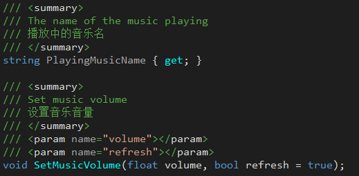
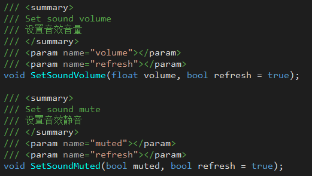

## 5. 音频管理模块(AudioManager) 
完善的音频管理模块，支持场景与UI的音乐音效同时，去除Assetbundle的依赖。  

+ **JLGames.GameDriver.Actions.Audio** 提供了音频管理全部的功能支持。
+ 音频的加载使用默认的加载器(Loader)，同时也支持自定义的加载器。
+ 采用Ico方式注入音频资源信息。
+ 无须直接引用音频资源，实现了资源使用与资源打包的分离。  
+ 支持缓存设置，减少加载消耗。

### 5.1 初始化

#### 5.1.1 生成配置资产
执行菜单 “Tools -> GameDriver -> Project -> Gen AudioSettings”。  
在项目Assets/Resources下会生成 AudioSettings.asset(可重命名) 文件。  
  
+ SysSettings为系统级别的设置，用户无法修改。
+ UserSettings为用户级别的设置，开放AP修改。I

#### 5.1.2 设置管理物件
复制GameDriver/Assets/AudioManager/Prefabs/AudioManager.prefab到项目初始化场景中，并重新关联AudioSettings.asset  
  
+ Dont Destroy OnLoad 场景销毁时是否保存物件
+ Music Register Infos 音乐信息预处理注册表
+ Sound Register Infos 音效信息预处理注册表

#### 5.1.3 设置音频加载器：
```C#
AudioManagerPool.Shared.SetLoaderAdapter(new AudioLoader());
```
如果要必要自定义加载， 实现IAudioLoader接口即可。  

### 5.2 使用 

#### 5.2.1 注册音频信息(可选)
可以在脚本中使用AudioManager函数注册音频信息  
  
  

#### 5.2.2 播放音乐、播放音效
+ AudioManger中以SwitchMusic开头的函数为播放音乐提供支持。
+ AudioManager中以PlaySound开头的函数为播放音效提供支持。
+ 音乐音效的播放支持**不注册**直接播放。

#### 5.2.3 音频设置
+ AudioManager 支持音乐静音与音量设置。
  
+ AudioManager 支持音效静音与音量设置。
  

#### 5.2.4 建议包装组件进行使用，如：
示例中的AudioDemoMusicNode、AudioDemoSoundNode组件。  

#### 5.3 示例
GameDriver/Samples/Audio  
  