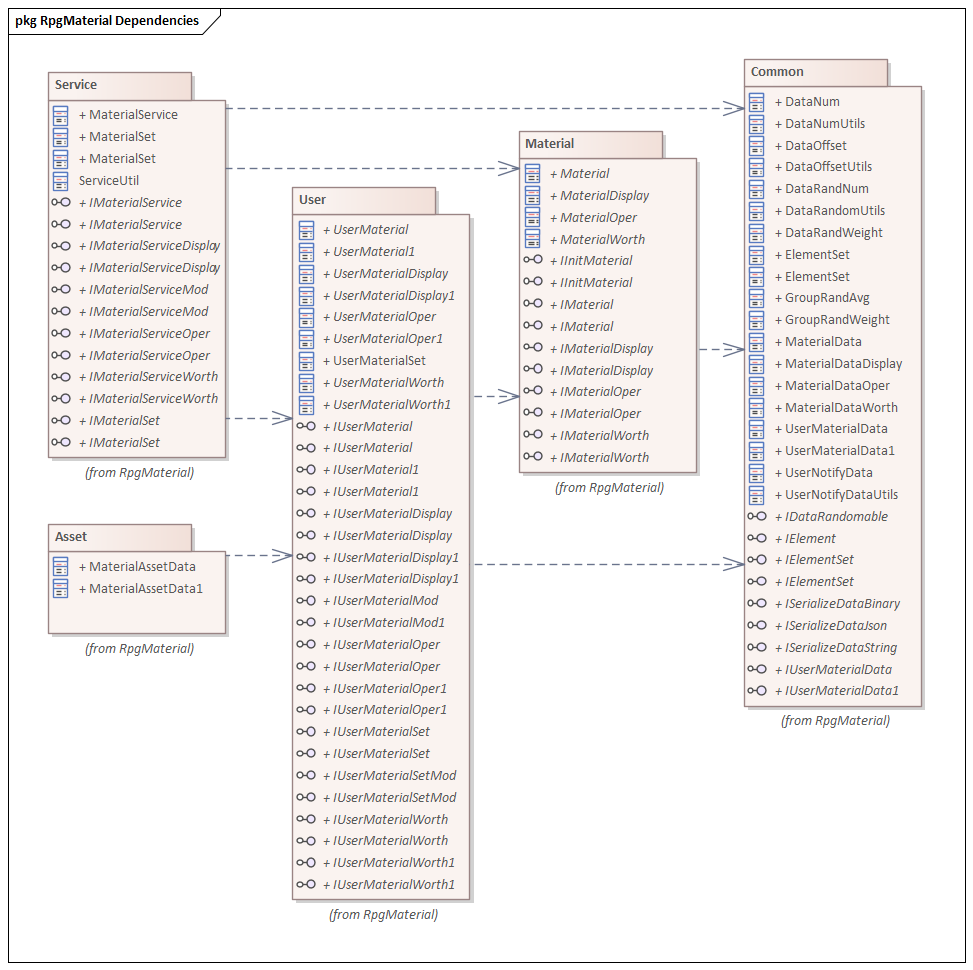
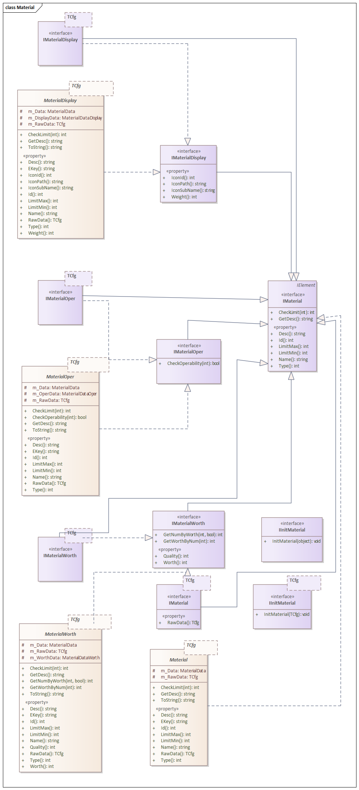
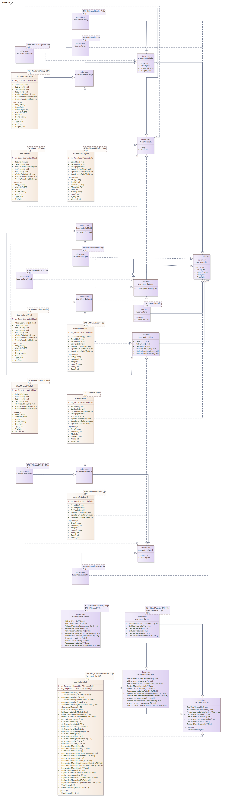

## 8. Rpg材料数据系统
这是一套通用的用户数据管理系统。  
针对玩家的数值型数据，以KTV(Key-Type-Value)形式进行管理。  
+ **JLGames.GameDriver.Games.RpgMaterial** 
  提供了Rpg材料数据系统的功能支持。依赖关系如下：  
    
  + **JLGames.GameDriver.Games.RpgMaterial.Common**
  系统的基础数据结构。  
  + **JLGames.GameDriver.Games.RpgMaterial.Material**
  系统中关于材料定义的数据结构。  
  + **JLGames.GameDriver.Games.RpgMaterial.User**
  系统中关于用户数据存储的数据结构。  
  + **JLGames.GameDriver.Games.RpgMaterial.Service**
  系统中关于对外提供接口支持的数据结构。  
  + **JLGames.GameDriver.Games.RpgMaterial.Asset**
  系统中针对Unity进行序列化的数据结构。  

### 8.1 设计思路
+ 用户数据的元数据(配置数据)以 **KTD(Key-Type-Define)** 格式进行管理。
+ 元数据(配置数据)的来源可以是数值表导出、服务器获取、资产配置等方式得到。
+ 通过 **KT(Key&Type)** 能得到元数据(配置数据)定义(Define)，并且可以在用户数据设置时进行有效性检查。
+ 用户数据以 **KTV(Key-Type-Value)** 格式进行管理(内存、本地文件、服务器等)。
+ 同一条元数据定义下，如果用户数据要求有多条，则采用 **KTUV(Key-Type-UId-Value)** 形式进行保存，既兼容了普通数据格式，也支持了多条数据的要求。
+ 用户数据(Value)通常情况下使用基础数值类型则满足需求，当然游戏设计者可以扩展数据的存储结构。
+ 通过 **KT(Key&Type)** 或 **KTU(Key&Type&UId)** 能得到玩家的具体数据(Value)，用于运算与展示。
+ 用户数据的变更以通知的形式下发，支持增量变更与直接更新两种。

#### 8.1.1 Common模块设计说明
+ 提供数据对象的基础管理功能，并定义了数据对象的最基础的接口.
+ 提供最基础的配置数据接口定义和相关的数据结构实现。
+ 提供最基础的用户数据接口定义和相关的数据结构实现。
+ 提供可选的扩展接口定义。
+ 提供用于基础计算的数据结构实现。
+ 

##### 8.1.1.1 Common接口设计
+ IElement
  数据对象基础接口  
+ IElementSet 
  数据集合基础接口，用于管理IElement对象。  
+ IUserMaterialData和IUserMaterialData
  用户数据相关接口。  
+ ISerializeDataBinary、ISerializeDataJson和ISerializeDataString
  数据序列化相关接口。  
+ IDataRandomable
  数量随机相关接口。  

##### 8.1.1.2 Common数据结构设计
+ ElementSet
  IElementSet的实现类，提供对IElement对象的管理功能，可用于继承或组合。  

+ 配置数据相关数据结构
  + MaterialData
    配置数据基础，包含Id, 名称、类型、大小约束、描述。  
  + MaterialDataDisplay
    配置数据显示相关数据，包含图标Id、显示权重。  
  + MaterialDataOper
    配置数据操作行为设定，包含按位定义值。  
    **操作行为设定**：  
    + 假设二进制第1位定义为可使用，第2位定义为可丢弃。
    + 当值为二进制(11)时，代表数据定义即可使用也可丢弃。
  + MaterialDataWorth
    配置数据价值定义相关数据，包含价值、品质。  
    **价值定义**：  
    + 类型市场商品标出的单价。
    + 用于不同配置间数量比较与计算。

+ 用户数据相关数据结构
  + UserMaterialData
    用户数据基础，包含Id(对应MaterialData的Id)、类型(对应MaterialData的类型)、数量  
  + UserMaterialData1
    继承于UserMaterialData,，增加唯一Id这个属性  

+ 计算和通知相关数据结构
  + DataNum
    + Id、类型
      用于定位配置数据项与用户数据项  
    + 数量
      用于覆盖用户数据项中的数量  
  + DataOffset
    + Id、类型
      用于定位配置数据项与用户数据项  
    + 偏移值
      用于与用户数据项中的数量相加，结果覆盖用户数据项中的数量  
  + UserNotifyData
    通过DataNum、DataOffset数据进行更新用户数据后，可计算出UserNotifyData结果，用于通知前端显示效果。  

+ 随机相关数据结构
  + DataRandNum
    在最小值与最大值间进行均值随机。  
  + DataRandWeight
    针对万分权值进行随机，只有真和假两个结果。  
  + GroupRandAvg
    多个数值中随机一个，概率平均。  
  + GroupRandWeight
    多个数值中随机一个，概率依赖权值。  

##### 8.1.1.3 Common工具类设计
+ DataNumUtils
  针对DataNum相关的行为逻辑  
+ DataOffsetUtils
  针对DataOffset相关的行为逻辑  
+ UserNotifyDataUtils
  针对UserNotifyData相关的行为逻辑  
+ DataRandomUtils
  针对IDataRandomable接口实现类的随机逻辑  

#### 8.1.2 Material模块设计说明
+ 提供配置数据的常用接口定义和相关实现。
+ 使用Common中的接口和数据结构进行组合使用。
+ 

##### 8.1.2.1 Material接口设计
+ IMaterial
  继承自 IElement，并定义了配置数据的常用属性与功能。  
+ IMaterialDisplay
  继承自 IMaterial，进一步定义了有显示功能的配置数据的属性与功能。  
+ IMaterialOper
  继承自 IMaterial，进一步定义了有操作行为的配置数据的属性与功能。  
+ IMaterialWorth
  继承自 IMaterial，进一步定义了有价值定义的配置数据的属性与功能。  
+ IMaterialSet
  继承自 IElementSet，并定义了配置数据集合的常用功能。  
+ IInitMaterial、IInitMaterial\<TCfg\>
  定义配置数据的初始化逻辑接口。  

##### 8.1.2.2 Material数据结构设计
**注意**：以下数据结构的逻辑实现，依赖于Common中的数组结构，使用方式为**组合**。  
+ Material
  实现 IMaterial 的抽象类，实现部分功能，子类可重写行为。  
+ MaterialDisplay
  实现 IMaterialDisplay 的抽象类，实现部分功能，子类可重写行为。  
+ MaterialOper
  实现 IMaterialOper的 抽象类，实现部分功能，子类可重写行为。  
+ MaterialWorth
  实现 IMaterialWorth 的抽象类，实现部分功能，子类可重写行为。  

#### 8.1.3 User模块设计说明
+ 提供了普通用户数据功能。
+ 提供了带唯一Id的用户数据功能。
+ 提供了用于管理用户数据集合功能。
+ 

##### 8.1.3.1 User接口设计
+ IUserMaterial 和 IUserMaterial1
  + IUserMaterial
    继承自 IElement，定义了用户数据的属性与功能。  
  + IUserMaterial1
    继承自 IUserMaterial，增加了唯一Id的属性。  
+ IUserMaterialDisplay 和 IUserMaterialDisplay1
  + IUserMaterialDisplay
    继承自 IUserMaterial，增加了与显示功能相关的属性与功能。  
  + IUserMaterialDisplay1
    继承自 IUserMaterialDisplay，增加了唯一Id的属性。  
+ IUserMaterialOper 和 IUserMaterialOper1
  + IUserMaterialOper
    继承自 IUserMaterial，增加了与操作行为相关的属性与功能。  
  + IUserMaterialOper1
    继承自 IUserMaterialDisplay，增加了唯一Id的属性。  
+ IUserMaterialWorth 和 IUserMaterialWorth1
  + IUserMaterialWorth
    继承自 IUserMaterial，增加了与价值相关的属性与功能。  
  + IUserMaterialWorth1
    继承自 IUserMaterialWorth，增加了唯一Id的属性。  
+ IUserMaterialMod 和 IUserMaterialMod1
  + IUserMaterialMod
    定义用户数据的修改接口  
  + IUserMaterialMod1
    定义带唯一Id的用户数据的修改接口  
+ IUserMaterialSet
  定义用户数据集合中关于读取、查找相关的接口  
+ IUserMaterialSetMod
  定义用户数据集合中关于修改相关的接口  

##### 8.1.3.2 User数据结构设计
**注意**：以下数据结构的逻辑实现，依赖于Common中的数组结构，使用方式为**组合**。

+ UserMaterial 和 UserMaterial1
  + UserMaterial
    实现 IUserMaterial 的抽象类，实现部分功能，子类可重写行为。  
  + UserMaterial1
    实现 IUserMaterial1 的抽象类，实现部分功能，子类可重写行为。  
+ UserMaterialDisplay 和 UserMaterialDisplay1
  + UserMaterialDisplay
    实现 IUserMaterialDisplay 的抽象类，实现部分功能，子类可重写行为。  
  + UserMaterialDisplay1
    实现 IUserMaterialDisplay1 的抽象类，实现部分功能，子类可重写行为。  
+ UserMaterialOper 和 UserMaterialOper1
  + UserMaterialOper
    实现 IUserMaterialOper 的抽象类，实现部分功能，子类可重写行为。  
  + UserMaterialOper1
    实现 IUserMaterialWorth1 的抽象类，实现部分功能，子类可重写行为。  
+ UserMaterialWorth 和 UserMaterialWorth1
  + UserMaterialWorth
    实现 IUserMaterialWorth1 的抽象类，实现部分功能，子类可重写行为。  
  + UserMaterialWorth1
    实现 IUserMaterialWorth1 的抽象类，实现部分功能，子类可重写行为。  
+ UserMaterialSet
   实现 IUserMaterialSet 的抽象类，实现部分功能，子类可重写行为。  

#### 8.1.4 Service模块设计说明
+ 材料 Service 的设计扩展了[服务框架](Manual-7.Service_cn.md)功能。
+ 材料 Service 的分类应该与类型(指配置数据中的类型)一一对应，也就是一种类型创建一个Service。
+ 提供了材料 Service 的基本接口定义。
+ 提供了可显示材料、可操作材料、有价值材料的基本接口定义。
+ 提供了材料service的一个默认实现类，可按需使用。不建议直接修改和继承。
+ 

##### 8.1.4.1 Service接口设计
+ IMaterialService
  材料 Service 的基本接口定义。  
+ IMaterialServiceDisplay
  可显示材料 Service 的基本接口定义。  
+ IMaterialServiceOper
  可操作材料 Service 的基本接口定义。  
+ IMaterialServiceWorth
  价值材料 Service 的基本接口定义。  
+ IMaterialServiceMod
  材料service的与修改相关的接口定义。  

##### 8.1.4.2 Service逻辑设计
+ MaterialService
  一个默认的材料服务实现类，可按需使用。不建议直接修改和继承。  
  内部功能由 User、Material、Common 中的功能单元组合而成。  
+ ServiceUtil
  提供一些与 service 相关的基础逻辑函数。  

#### 8.1.5 Asset模块设计说明
+ MaterialAssetData
  材料用户数据的序列化结构，用于Unity面板。  
+ MaterialAssetData1
  带唯一Id的材料用户数据的序列化结构，用于Unity面板。  
+ 

### 8.2 使用
依赖于服务框架，具体使用流程与一般服务一致。  

#### 8.2.1 材料数据分类
按照业务需求，把材料配置表数据进行分类  

#### 8.2.2 准备接口
每类材料创建一个服务接口，至少继承 IInitService、IInitDataService、IMaterialService  
+ IInitService
  用于初始化材料配置数据  
+ IInitDataService
  用于初始化材料用户数据。  
  **用户数据来源**：  
  1. 服务器请求
  2. 本地缓存文件
  3. 其它来源
+ IMaterialService
  提供一些材料相关的属性与功能。  

#### 8.2.3 实现接口
实现上一步创建的接口。  

#### 8.2.4 按照服务框架流程使用
按照[服务框架说明](Manual-7.Service_cn.md#7.4)，注册、初始化、调用。  

### 8.3 示例
GameDriver/Samples/Service  
具体示例服务实现类为ResourceService, 服务名称定义为"ServiceName.Material_1"  
  