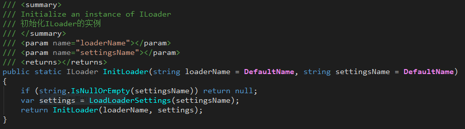
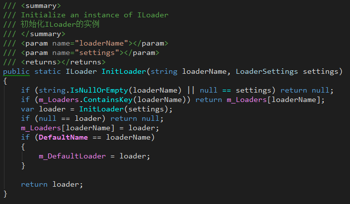
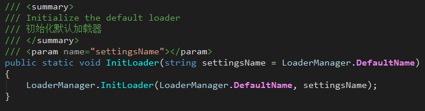
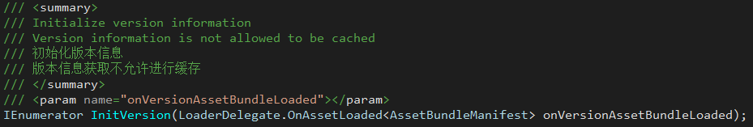
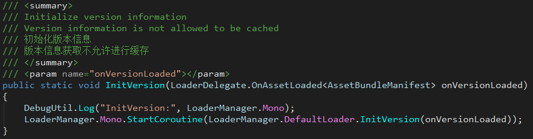
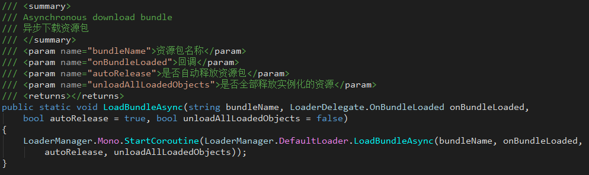
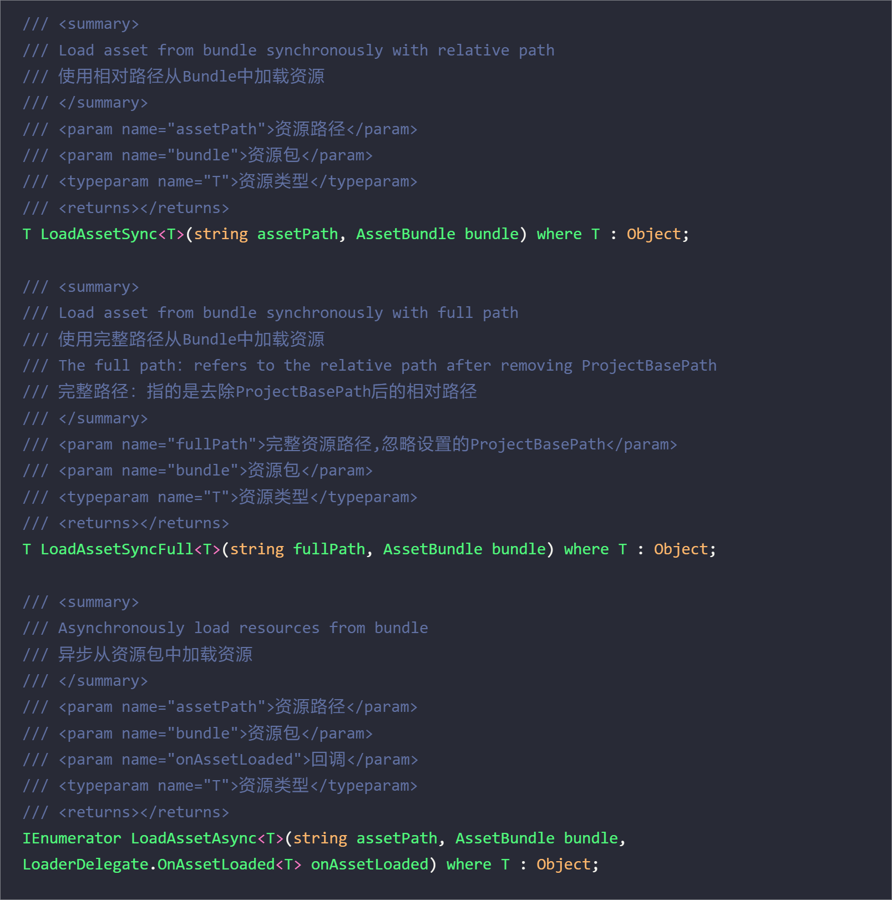
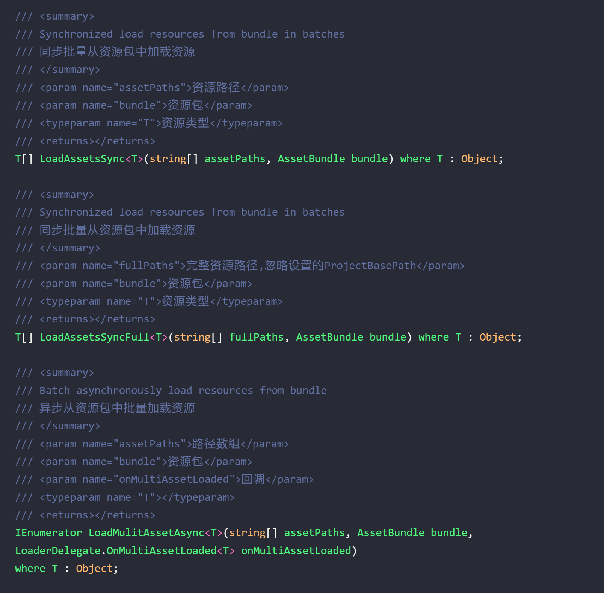
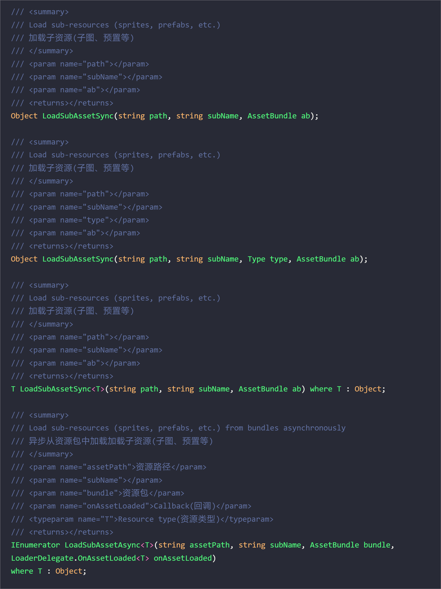
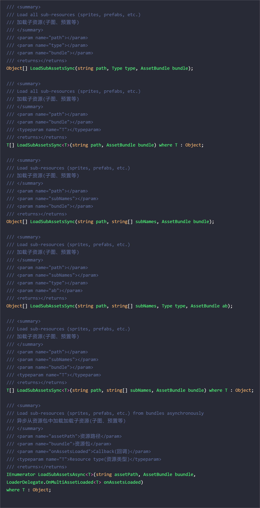

## 2. Loading management module (Loader) - supports free switching of three modes: Resources, Editor, Assetbundle

+ **JLGames.RocketDriver.Actions.Loader** provides full support for the loader.
+ **"Tools -> RocketDriver -> Project -> Gen LoaderSettings"** provides the generation entry for the loader configuration file.

### 2.1 Initialization

#### 2.1.1 Generate configuration assets
Execute menu "Tools -> RocketDriver -> Project -> Gen LoaderSettings".  
The LoaderSettings.asset (renameable) file will be generated under the project Assets/Resources.  
  
  

#### 2.1.2 Set configuration according to project requirements
There are 5 available configurations in LoaderSettings, one Editor mode, two Resource modes, and two AssetBundle modes.  

+ Editor configuration
  ProjectBasePath can set the base path part of the project's resource search, which can be spliced before the resource path when loading resources.
  
+ Resource configuration
  ProjectBasePath can set the base path part of the project's resource search, which can be spliced before the resource path when loading resources.  
     
+ AssetBundle configuration

  + BundleSource
    You can choose three modes: Web, Streaming Assets, and File Debug.  
    + Web
      Used to load AssetBundle assets stored directly on the site.  
      Fill in the site Url in Web Site Url.  
      Fill in the Parttern path in the Web Site Pattern.  
        
    + Streaming Assets
      Used to load AssetBundle resources stored in the project StreamingAssets.  
      Fill in the relative path relative to StreamingAssets in Streaming Parttern.  
        
    + File Debug
      Used to load AssetBundle resources in the local file system, mostly used for debugging.  
      Fill in the local file path in File Url.  
      Fill in the relative path related to File Url in File Pattern.  
        
  + Base Settings
    It is mainly about the setting of the Bundle directory information of the project and the setting of the cache information when loading.  
    + Project Base Path Set the Bundle directory path of the project
    + CacheName Set the name of the cache area, this can be customized.
    + Version Size Sets the number of versions of each Bundle asset to keep in the cache.
    + History size sets the number of cache areas, each CacheName will generate a cache area.
  + Resource Release Strategy
    There are three options: None, Time, and Counter.  
    + None means that the release strategy is not selected. The invalid memory occupation generated after releasing the Bundle and assets needs to be released by calling gc. This strategy is suitable for self-management of memory and gc timing.
    + Time is a timing release strategy, which will call gc according to the set time period.
        
    + Counter is a count release strategy. When the bundle loaded resource reaches the set value and multiple value, gc is called.
        

#### 2.1.3 Initializing Loaders with Configuration
Initialize the loader with the following API:  
+ Initialize with the configuration file name generated by [first point]().
  
+ Initialize with a configuration instance.
  
+ There is a shortcut initialization function in the Loader static class:
  

#### 2.1.4 Initialize Bundle version information
Call the function in the loader instance:  
   

+ The function callback is executed after the initialization version ends, and the initialization result can be judged internally: success or failure.
+ The function requires to open the coroutine call, you can use LoaderManager.Mono to open the coroutine:
   

### 2.2 Use

#### 2.2.1 Load Bundle assets
Bundle assets can be loaded only after the Bundle version information is initialized.  
The loader implements the IBundleLoader interface and contains functions related to loading Bundle assets.  
Loading Bundle assets requires the use of coroutines, which can be enabled using a LoaderManager.Mono instance to load Bundles by coroutines. 
  

+ bundleName: bundle asset name.
+ onBundleLoaded: Execute the result callback, which can be used to determine whether it is successful or not.
+ autoRelease: Indicates whether to release the bundle instance after onBundleLoaded execution ends
+ unloadAllLoadedObjects: Indicates whether to release the resource assets instantiated from the bundle instance after onBundleLoaded execution ends
+ If autoRelease is true, all assets to be used should be instantiated in onoBundleLoaded.

#### 2.2.2 Loading resource assets
In the case of obtaining the bundle instance, the instance of the resource asset can be instantiated from the bundle instance, and then cloned and used.  
It is recommended to use synchronous functions for loading resource assets, and asynchronous functions are not recommended. The reason is that Unity does not support opening coroutines within coroutines friendly, and if there are too many layers (like 16 layers), unpredictable errors will appear.  

The IAssetLoader interface functions are divided into four categories:  
  + Single resource asset loading (sync|async)  
       
  + Batch resource asset loading (sync|async)  
    
  + Single sub-resource asset loading (sync|async)  
       
  + Batch sub-resource asset loading (sync|async)  
       
  + For more usage, please refer to the example, API or source code.  

### 2.3 Example
JLGames/RocketDriver/Samples/Loader  
  