## 6. Panel Manager (PanelManager)
+ **JLGames.GameDriver.Actions.Layer** provides container level management.
+ **JLGames.GameDriver.Games.PanelManager** provides panel management functions.
+ The usage process of the panel management module: registration -> display -> close
+ If the cached panel is not destroyed, it is recommended to move the panel off the screen.

### 6.1 Registration Information

#### 6.1.1 Registration layer container information
````C#
PanelManagerShared.Manager.Register.RegisterLayer(containerName, 
  tranContainer, isDefault);
````
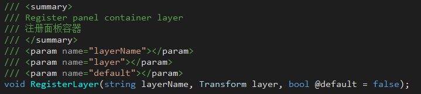  
+ layerName: Specify a name for the registered layer information, regardless of the layer's name attribute.
+ layer: The Transform component reference of the layer.
+ default: Whether to set to default, if true, when opening the panel without specifying a layer name, the default layer is selected.

#### 6.1.2 Registering background processing information
````C#
PanelManagerShared.Manager.Register.RegisterBackground(backgroundKey, 
  backgroundOrigin, backgroundScript);
````
  
+ key: Specify a key for the registered background information to identify the uniqueness of the information.
+ origin: The prefab for the background, when the panel is shown, the cloned prefab is added to the bottommost layer of the panel container.
+ script: The class name (including namespace) of the script component that handles the background logic.

#### 6.1.3 Register animation information
````C#
PanelManagerShared.Manager.Register.RegisterAnimator(animKey, animAnimator);
````
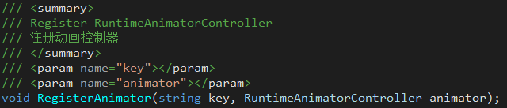  
+ key: Specify a Key for the registered animation information, which is used to identify the uniqueness of the information.
+ animator: Animate the RuntimeAnimatorController component.

#### 6.1.4 Setting the base container for the panel
````C#
PanelManagerShared.Manager.Register.RegisterPanelContainer(container);
````
  
+ container: The prefab of the panel container. When the panel is displayed, the cloned prefab is added to the display layer as the panel root node, and the actual content task child node of the panel is added to the panel container.

#### 6.1.5 Registration panel information
````C#
PanelManagerShared.Manager.Register.RegisterPanelInfo(panelId,
  settings, maxDisplayNum, extendType);
````
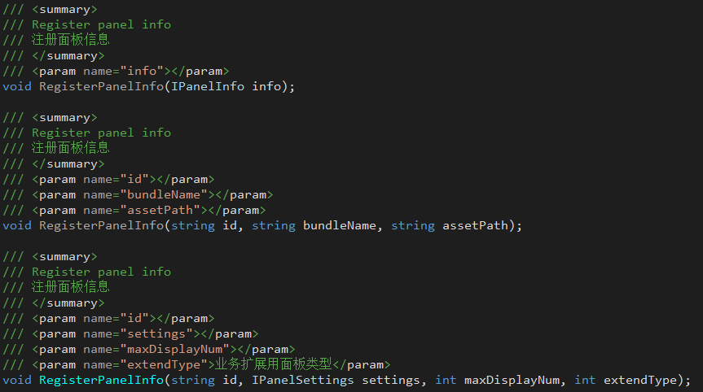  
+ Panel information is finally saved as an instance of IPanelInfo for search and display.
+ When the project is used, the configuration information of the project panel should be read and registered.

#### 6.1.6 Using the PanelManagerRegister component, you can handle the registration function of layer container, background, animation and panel information at the same time
  

#### 6.1.7 Note
**Background registration** and **Animation registration** **optional**, only register when there are relevant requirements in the panel information.  

### 6.2 Display Panel

#### 6.2.1 To pop up a panel by panel id, you can select the specified panel layer container.
````C#
PanelManagerShared.Manager.ShowPanel(panelId);
````
  

#### 6.2.2 Pop up the panel through the panel id, and pass in the parameter object, you can choose to specify the panel layer container.
````C#
PanelManagerShared.Manager.ShowPanel(panelId, panelParams);
````
  

### 6.3 Close Panel

#### 6.3.1 Close the panel by the panel id. 
You can choose to close the default, close the first display, and close the last display through the panel id:  
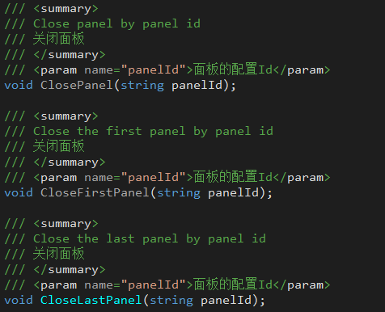  

#### 6.3.2 Close the panel through instance information. 
Close the panel accurately by providing the panel instance Id (instanceId), display view (view), and panel instance (IPanelInstance).  
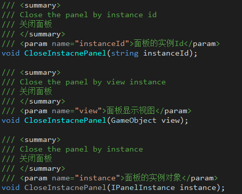  

#### 6.3.3 Close panels in batches. 
You can choose to close all displayed panels, close all panels with a specified panel id, or close panels that match the matching function.  
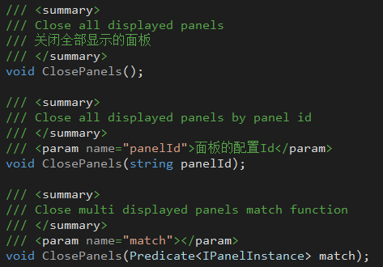  

### 6.4 Advanced Applications

#### 6.4.1 Custom Registrar
The registrar in IPanelManager can be customized, as long as the IPanelRegister interface is implemented.  
  

#### 6.4.2 Custom Loaders
The loader in IPanelManager can be customized, as long as the IIPanelLoaderAdapter interface is implemented.  
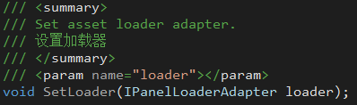  

#### 6.4.3 Set panel display timing
SetShowMoment in IPanelManger can set the panel display timing (immediate display | frame end display)  
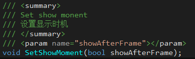  
+ show immediately
  When the code is executed, the loading process is performed immediately. Add panels to the display node as soon as the asset is ready.
+ end of frame display
  When the code is executed, the loading process is performed immediately. When the resource preparation is complete, start the coroutine, wait for WaitForEndOfFrame, and add the panel to the display node.

#### 6.4.4 IPanelSettings Description
The IPanelSettings instance is the interface of the panel configuration information saved when the panel is registered, including resource configuration, background configuration and animation configuration.  

##### 6.4.4.1 Resource Configuration
IPanelAssetSettings instance  
Main configuration properties: BundleName, AssetPath, MainScriptName, MainScriptParams  
  
+ BundleName
  The name of the Assetbundle where the panel assets are located
+ AssetPath
  The path of the panel asset in the Assetbundle
+ MainScriptName
  If the panel has a main script, the full class name (including namespace) of the main script is returned.
  Returns null or an empty string without a main script.
  +MainScriptParams
  It takes effect when MainScriptName exists and implements the IParamsPanel interface, and is the incoming parameter of the function SetPanelStringParams.

##### 6.4.4.2 Background configuration
IPanelBackgroundSettings instance  

+ basic parameters
  + OriginKey
    The key specified when the background information is registered  
  + OriginInfo
    Find out the registration information through the key specified during the registration of the background information, and take the origin prefab.  
  + Mode
    Four background modes are supported: None, Color, Image, Screenshot  
    + None
    Dependency coefficient: none  
    + Color
    Dependency coefficient: Color  
    + Image
    Dependencies: ImageSprite, ImageBundle, ImagePath, BlurFactor  
    + Screenshot
    Dependency factor: ScreenshotFactor  
+ Mode related parameters
  + Color [Valid when Mode=Color]
    background color value, used to set the background color value  
  + ImageSprite [Valid when Mode=Image]
    Two cases: ImageSprite is not empty, ImageSprite is empty.  
    + ImageSprite is not empty
      Ignore ImageBundle and ImagePath parameters, use ImageSprite to fill.  
    + ImageSprite is empty
      Through the loader in Register, use ImageBundle and ImagePath to load Sprite fills.  
  + ImageBundle and ImagePath [effective when Mode=Image]
    Used when the ImageSprite is empty, to load the Sprite resource.  
  + BlurFactor [Valid when Mode=Image]
    Blur factor: [0,1]  
  + ScreenshotFactor [Valid when Mode=Screenshot]
    Screenshot image blur factor  

##### 6.4.4.3 Animation Configuration
IPanelAnimSettings instance  
  
+ OpenKey
  The key used when animation information is registered, used to find animations  
+ OpenState
  The state name in the animation Animator, used to play the specified animation  
+ CloseKey
  The key used when animation information is registered, used to find animations  
+ CloseState
  The state name in the animation Animator, used to play the specified animation  

#### 6.4.5 Panel function extension
At this stage, there are 4 interfaces related to panel function expansion:  
IInitPanel, IParamsPanel, IRefreshPanel, IDisposePanel  
**NOTE**: IShowPanel, IClosePanel are **deprecated**.  
+ IInitPanel
  Used for panel initialization, the call timing is after OnEnable  
  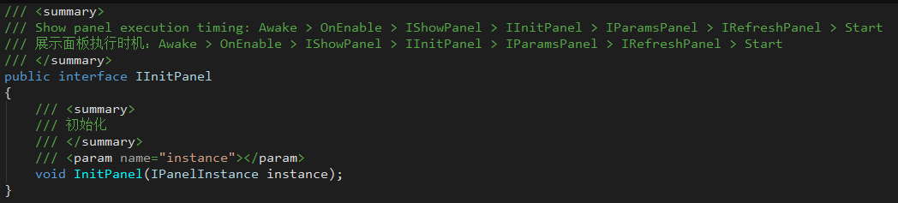  
  +IParamsPanel
  Used for panel injection parameters.  
    
  
  + SetPanelObjectParams
    Triggered when calling ShowPanel with parameters passed in.  
  + SetPanelStringParams
    Triggering requires both of the following conditions:  
    1. No parameters were passed when calling ShowPanel.
    2. When registering panel information, MainScriptParams in IPanelAssetSettings configuration is not empty. The incoming parameter is the value of MainScriptParams.

+ IRefreshPanel
  Used when the panel refresh logic is not suitable for use in Start or Awake.  
  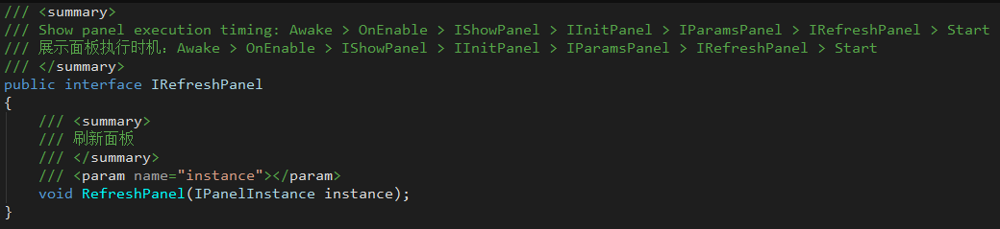  
+ IDisposePanel
  Called when the panel is about to be destroyed to perform the release behavior.  
    

### 6.5 Example
GameDriver/Samples/Panel  
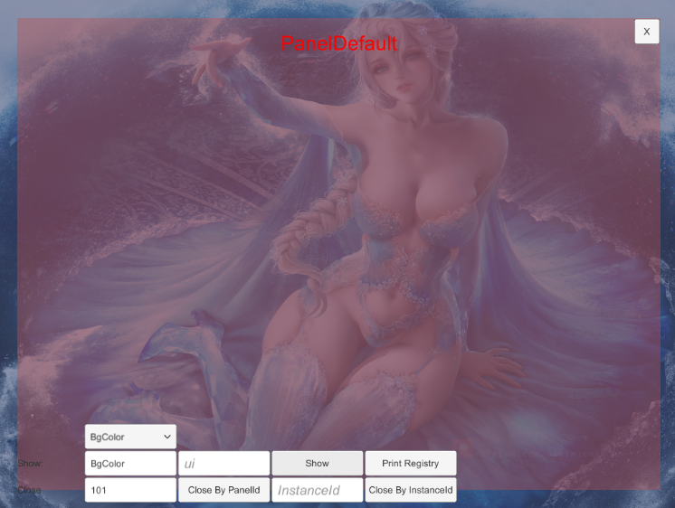  