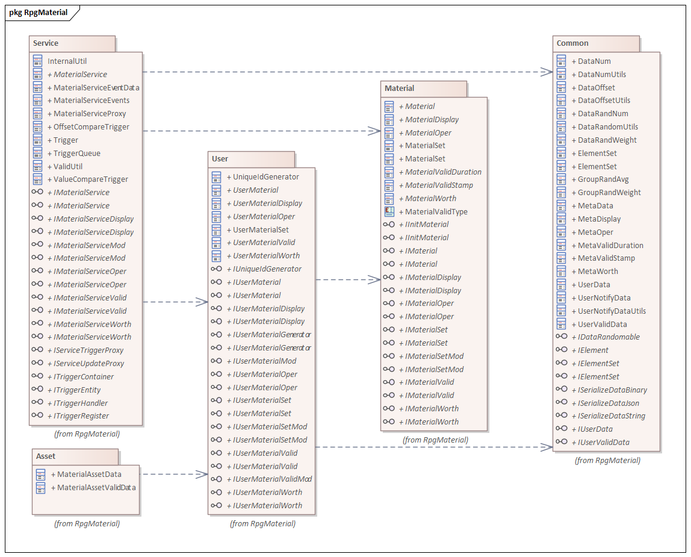
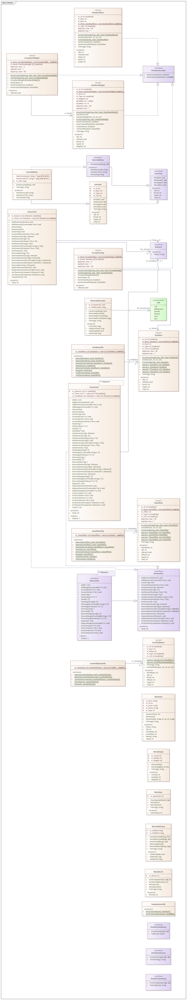
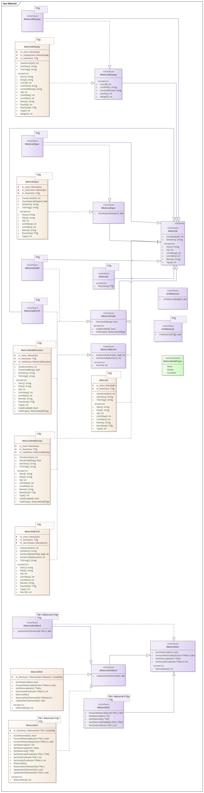
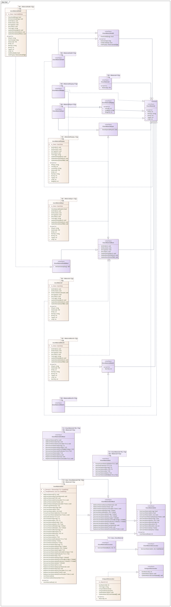
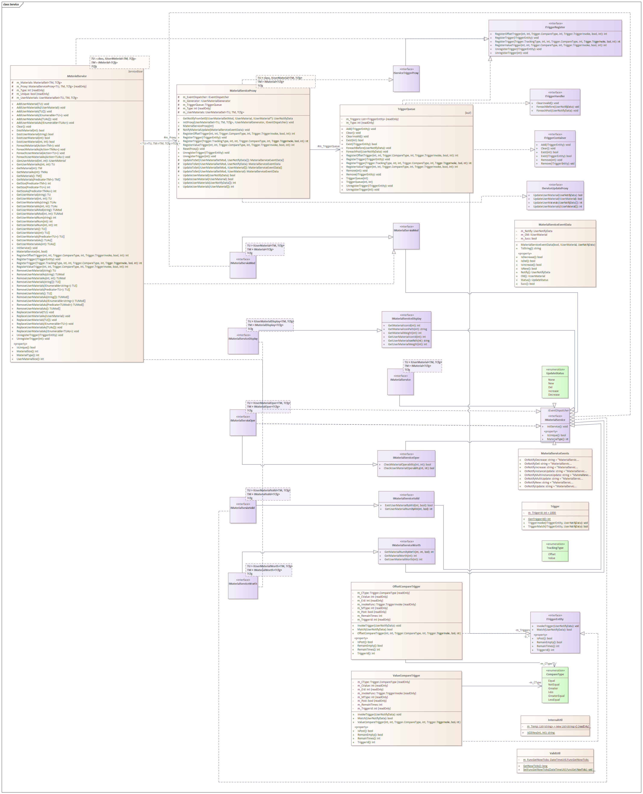
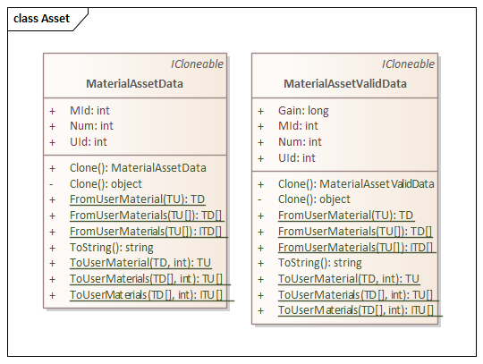

## 8. Rpg Material Data System
This is a general game data management system.  
The player's numerical data is managed in the form of KTV (Key-Type-Value).  
+ **JLGames.GameDriver.Games.RpgMaterial**
  Provides functional support for the Rpg material data system. The dependencies are as follows:  
    
  + **JLGames.GameDriver.Games.RpgMaterial.Common**
  The basic data structure of the system.  
  + **JLGames.GameDriver.Games.RpgMaterial.Material**
  A data structure in the system about material definitions.  
  + **JLGames.GameDriver.Games.RpgMaterial.User**
  The data structure in the system about user data storage.  
  + **JLGames.GameDriver.Games.RpgMaterial.Service**
  The data structure in the system that provides external interface support.  
  + **JLGames.GameDriver.Games.RpgMaterial.Asset**
  The data structure in the system that is serialized for Unity.  

### 8.1 Design Ideas
+ Metadata (configuration data) of user data is managed in **KTD(Key-Type-Define)** format.
+ The source of metadata (configuration data) can be derived from value table export, server acquisition, asset configuration, etc.
+ Through **KT(Key&Type)**, the metadata (configuration data) definition (Define) can be obtained, and the validity can be checked when the user data is set.
+ User data is managed in **KTV(Key-Type-Value)** format (memory, local file, server, etc.).
+ Under the same metadata definition, if multiple pieces of user data are required, they will be saved in the form of **KTUV(Key-Type-UId-Value)**, which is compatible with both common data formats and multiple pieces of data. Require.
+ User data (Value) usually uses basic numerical types to meet the needs, of course, game designers can expand the storage structure of data.
+ Through **KT(Key&Type)** or **KTU(Key&Type&UId)**, the player's specific data (Value) can be obtained for calculation and display.
+ Changes to user data are issued in the form of notifications, supporting both incremental changes and direct updates.

#### 8.1.1 Common module design instructions
+ Provides basic management functions of data objects and defines the most basic interface of data objects.
+ Provide the most basic configuration data interface definition and related data structure implementation.
+ Provide the most basic user data interface definition and related data structure implementation.
+ Provides optional extension interface definition.
+ Provides data structure implementations for basic computations.  
  

##### 8.1.1.1 Common interface design
+ IElement
  Data Object Base Interface  
+ IElementSet
  Data collection base interface for managing IElement objects.  
+ IUserMaterialData and IUserMaterialData
  User data related interface.  
+ ISerializeDataBinary, ISerializeDataJson and ISerializeDataString
  Data serialization related interface.  
+ IDataRandomable
  Number of random related interfaces.  

##### 8.1.1.2 Common data structure design
+ ElementSet
  The implementation class of IElementSet provides management functions for IElement objects, which can be used for inheritance or combination.  

+ Configuration data related data structures
  + MaterialData
    Configuration data base, including Id, name, type, size constraint, description.  
  + MaterialDataDisplay
    Configuration data displays related data, including icon ID and display weight.  
  + MaterialDataOper
    Configuration data manipulation behavior settings, including bit-wise defined values.  
    **Operation behavior settings**:  
    + Assume that the 1st bit of the binary is defined as usable and the 2nd bit is defined as discardable.
    + When the value is binary (11), it means that the data definition can be used or discarded.
  + MaterialDataWorth
    Configure data value to define relevant data, including value and quality.  
    **Value Definition**:  
    + The marked unit price of the type market item.
    + For quantity comparison and calculation between different configurations.

+ User data related data structures
  + UserMaterialData
    User data base, including Id (corresponding to the Id of MaterialData), type (corresponding to the type of MaterialData), quantity  
  + UserMaterialData1
    Inherited from UserMaterialData, add the unique Id attribute  

+ Calculate and notify related data structures
  + DataNum
    + Id, type
      Used to locate configuration data items and user data items  
    + quantity
      Used to override the quantity in the user data item  
  + DataOffset
    + Id, type
      Used to locate configuration data items and user data items  
    + offset value
      Used to add to the quantity in the user data item, the result overwrites the quantity in the user data item  
  + UserNotifyData
    After updating the user data through the DataNum and DataOffset data, the UserNotifyData result can be calculated to notify the front-end display effect.  

+ random correlation data structure
  + DataRandNum
    Randomize the mean between the minimum and maximum values.  
  + DataRandWeight
    There are only two results, true and false, for the random weights.  
  + GroupRandAvg
    Random one of multiple values, with average probability.  
  + GroupRandWeight
    Random one of multiple values, the probability depends on the weight.  

##### 8.1.1.3 Common tool class design
+ DataNumUtils
  Behavior logic related to DataNum  
+ DataOffsetUtils
  Behavior logic related to DataOffset  
+ UserNotifyDataUtils
  Behavior logic related to UserNotifyData  
+ DataRandomUtils
  Random logic for the class implementing the IDataRandomable interface  

#### 8.1.2 Material Module Design Instructions
+ Provides common interface definitions and related implementations for configuration data.
+ Combination of interfaces and data structures in Common.  
  

##### 8.1.2.1 Material interface design
+ IMaterial
  Inherited from IElement and defines common properties and functions of configuration data.  
+ IMaterialDisplay
  Inherited from IMaterial, it further defines the properties and functions of configuration data with display function.  
+ IMaterialOper
  Inherited from IMaterial, it further defines the properties and functions of configuration data with operational behavior.  
+ IMaterialWorth
  Inherited from IMaterial, it further defines the properties and functions of the configuration data with valuable definitions.  
+ IMaterialSet
  Inherited from IElementSet and defines common functions for configuring data collections.  
+ IInitMaterial, IInitMaterial\<TCfg\>
  Defines the initialization logic interface for configuration data.  

##### 8.1.2.2 Material data structure design
**Note**: The logical implementation of the following data structure depends on the array structure in Common, and the usage method is **combination**.  
+ Material
  An abstract class that implements IMaterial, implements some functions, and subclasses can override behavior.  
+ MaterialDisplay
  The abstract class that implements IMaterialDisplay implements some functions, and subclasses can override the behavior.  
+ MaterialOper
  The abstract class that implements IMaterialOper, implements some functions, and subclasses can override the behavior.  
+ MaterialWorth
  An abstract class that implements IMaterialWorth, implements some functions, and subclasses can override the behavior.  

#### 8.1.3 User module design description
+ Provides normal user data functions.
+ Provides user data function with unique Id.
+ Provides functionality for managing user data collections.  
  

##### 8.1.3.1 User interface design
+ IUserMaterial and IUserMaterial1
  + IUserMaterial
    Inherited from IElement, defines the properties and functions of user data.  
  + IUserMaterial1
    Inherited from IUserMaterial, adding a unique Id property.  
+ IUserMaterialDisplay and IUserMaterialDisplay1
  + IUserMaterialDisplay
    Inherited from IUserMaterial, adding properties and functions related to the display function.
  + IUserMaterialDisplay1
    Inherited from IUserMaterialDisplay, adding the property of Unique Id.  
+ IUserMaterialOper and IUserMaterialOper1
  + IUserMaterialOper
    Inherited from IUserMaterial, adding properties and functions related to operation behavior.  
  + IUserMaterialOper1
    Inherited from IUserMaterialDisplay, adding the property of Unique Id.  
+ IUserMaterialWorth and IUserMaterialWorth1
  + IUserMaterialWorth
    Inherited from IUserMaterial, adding value-related properties and functions.  
  + IUserMaterialWorth1
    Inherited from IUserMaterialWorth, adding the unique Id attribute.  
+ IUserMaterialMod and IUserMaterialMod1
  + IUserMaterialMod
    Define the modification interface of user data  
  + IUserMaterialMod1
    Define a modification interface for user data with a unique Id  
+ IUserMaterialSet
  Define the interface related to reading and searching in the user data collection  
+ IUserMaterialSetMod
  Define the interface related to modification in the user data collection  

##### 8.1.3.2 User data structure design
**Note**: The logical implementation of the following data structure depends on the array structure in Common, and the usage method is **combination**.  

+ UserMaterial and UserMaterial1
  + UserMaterial
    The abstract class that implements IUserMaterial, implements some functions, and subclasses can override the behavior.  
  + UserMaterial1
    The abstract class that implements IUserMaterial1, implements some functions, and subclasses can override the behavior.  
+ UserMaterialDisplay and UserMaterialDisplay1
  + UserMaterialDisplay
    The abstract class that implements IUserMaterialDisplay implements some functions, and subclasses can override the behavior.  
  + UserMaterialDisplay1
    The abstract class that implements IUserMaterialDisplay1, implements some functions, and subclasses can override the behavior.  
+ UserMaterialOper and UserMaterialOper1
  + UserMaterialOper
    The abstract class that implements IUserMaterialOper, implements some functions, and subclasses can override the behavior.  
  + UserMaterialOper1
    The abstract class that implements IUserMaterialWorth1, implements some functions, and subclasses can override the behavior.  
+ UserMaterialWorth and UserMaterialWorth1
  + UserMaterialWorth
    The abstract class that implements IUserMaterialWorth1, implements some functions, and subclasses can override the behavior.  
  + UserMaterialWorth1
    The abstract class that implements IUserMaterialWorth1, implements some functions, and subclasses can override the behavior.  
+ UserMaterialSet
   The abstract class that implements IUserMaterialSet, implements some functions, and subclasses can override the behavior.  

#### 8.1.4 Service Module Design Instructions
+ The design of material Service extends the function of [Service Framework](Manual-7.Service_cn.md).
+ The classification of the material Service should correspond to the type (referring to the type in the configuration data) one-to-one, that is, a type creates a Service.
+ Provides the basic interface definition of Material Service.
+ Provides basic interface definitions for displayable materials, actionable materials, and valuable materials.
+ Provides a default implementation class of material service, which can be used as needed. Direct modification and inheritance are not recommended.  
  

##### 8.1.4.1 Service interface design
+ IMaterialService
  Basic interface definition for Material Service.  
+ IMaterialServiceDisplay
  Displays the basic interface definition of the Material Service.  
+ IMaterialServiceOper
  Basic interface definition for the Actionable Material Service.  
+ IMaterialServiceWorth
  Basic interface definition for Value Material Service.  
+ IMaterialServiceMod
  Modification-related interface definitions for material services.  

##### 8.1.4.2 Service Logic Design
+ MaterialService
  A default material service implementation class that can be used on demand. Direct modification and inheritance are not recommended.
  Internal functions are composed of functional units in User, Material, and Common.
+ ServiceUtil
  Provide some basic logic functions related to service.

#### 8.1.5 Asset Module Design Instructions
+ MaterialAssetData
  Serialized structure of material user data, used in Unity panels.  
+ MaterialAssetData1
  Serialized structure of material user data with unique Id for use in Unity panels.  
    

### 8.2 Use
Depends on the service framework(JLGames.GameDriver.Games.Services), and the specific usage process is consistent with the general service.  

#### 8.2.1 Classification of material data
Classify material configuration table data according to business needs  

#### 8.2.2 Prepare the interface
Create a service interface for each type of material, at least inherit IInitService, IInitDataService, IMaterialService  
+ IInitService
  Used to initialize material configuration data  
+ IInitDataService
  Used to initialize material user data.  
  **User data source**:  
  1. Server request
  2. Local cache file
  3. Other sources
+ IMaterialService
  Provides some material-related properties and functions.  

#### 8.2.3 Implementing the interface
Implement the interface created in the previous step.  

#### 8.2.4 Configure and initialize according to the service framework process
According to the [Service Framework Description] (Manual_7.Service_en.html#7.4), register, initialize, and call.  

#### 8.2.5 Other functions
+ By default, an event is thrown when the user data changes. Perform logic processing after data change by listening to corresponding events.
+ Supports trigger function by default, and supports trigger execution when user data changes.

### 8.3 Example
GameDriver/Samples/RpgMaterial  
  
+ Example Explanation
   1. Provides examples of three material types: Resource, Item, and Giftbag.
   2. An example of the material exchange function is provided.
   3. Provided an example of opening function of gift bag (Giftbag).