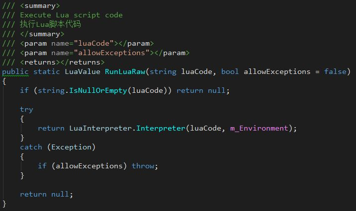
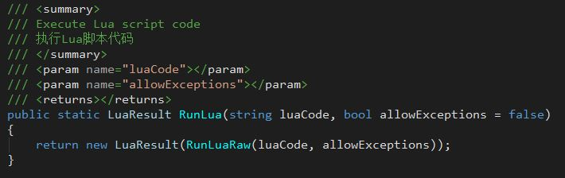
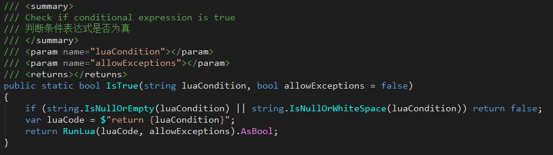
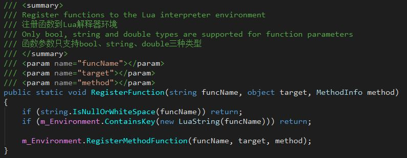
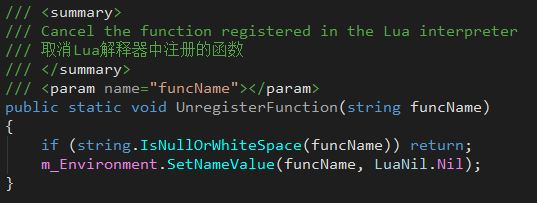
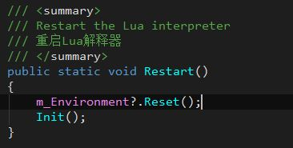
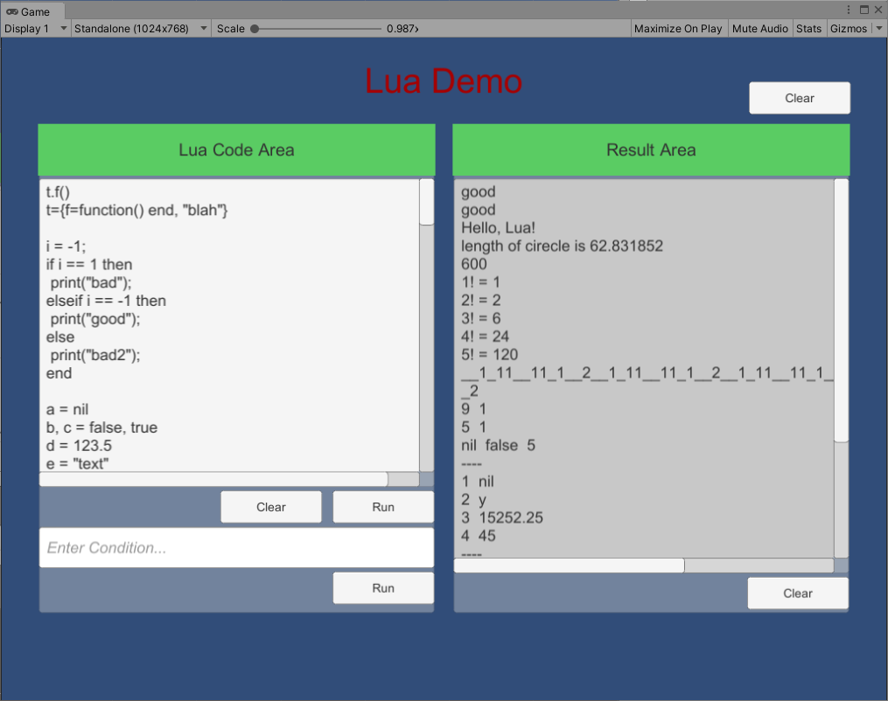

## 9. Lua Interpreter
+ Introduce a lightweight open source Lua interpreter: LuaInterpreter.  
+ Function extensions and optimizations to make it work better in Unity.  

### 9.1 Library Description

#### 9.1.1 Information Description
+ Name: **Lua Interpreter**  
+ Author: **Liu Junfeng**  
+ URL: http://www.codeproject.com/Articles/228212/Lua-Interpreter  
+ License: **MIT** (http://opensource.org/licenses/mit-license.php)  

#### 9.1.2 Modification Description
1. Removed WinFrom related code logic.  
2. Function extension of LuaTable class.  
3. Added several functions related to LuaValue.  
4. Add Unity to use the packaging class Lua, which is also a common function entry.  

### 9.2 Use

#### 9.2.1 Execute Lua script in C#
1. Call the `Lua.RunLuaRaw` function, or directly execute the Lua script. If there is a return value, get the return value.  
  
2. Call the `Lua.RunLua` function to execute Lua scripts. And the wrapper class LuaResult is returned for the return value.  
  
3. Call the `Lua.IsTrue` function to directly judge the Lua logical expression and obtain the resulting Boolean value.  
  

#### 9.2.2 Call C# function in Lua
1. First, the C# function needs to be registered in the Lua interpreter environment. We can use the `Lua.RegisterFunction` function to execute the registration logic.  
  
2. In the Lua script, use the registered funcName to call the registered function.  
3. If the same funcName is used repeatedly for registration, it will be overwritten.  
4. Use the `Lua.UnregisterFunction` function to unregister the behavior.  
  

#### 9.2.3 Restart Lua Interpreter
1. Use the `Lua.Restart` function to reset the Lua interpreter, which will clear all contexts.  
  

### 9.3 Examples
GameDriver/Samples/LuaDemo  
  